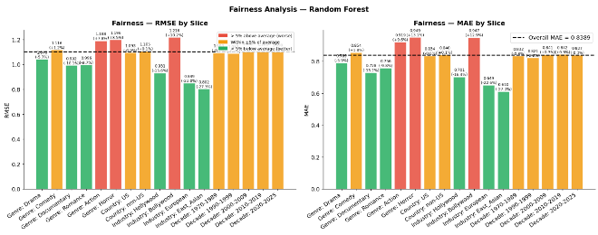
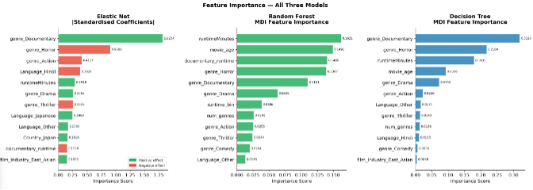
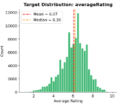

# Movie Rating Predictor

ML model to predict IMDb `averageRating` of a film **before** its release.


## Project Highlights
* **Best RMSE:** 1.099 (Random Forest)
* **Methodology:** Pipeline-based preprocessing with rigorous Data Leakage prevention.
* **Fairness:** Comprehensive analysis of model performance across genres, industries, and decades.

---

## Performance & Fairness Analysis
Our analysis reveals that the Random Forest model provides the most stable predictions.



*Figure 1: RMSE & MAE by slice. Note the performance variance in genres like Bollywood vs. East Asian films.*

---

## Feature Importance
Understanding what drives a film's predicted rating is crucial for model transparency.



*Figure 2: Importance scores across different models. Note the consistency of `genre_Documentary` as a primary predictor.*

---

## Data Distribution
The target variable (`averageRating`) shows a slight left-skewed distribution, which informed our choice of loss functions.



*Figure 3: Target variable distribution.*

---

## Project Overview

| | |
|---|---|
| **Course** | Machine Learning |
| **Dataset** | 133,884 films from IMDb |
| **Target** | `averageRating` (1.0 – 10.0) |
| **Best RMSE** | 1.099 (Random Forest) |
| **Validation** | 10-Fold Cross-Validation |
| **Reproducibility** | `random_state=42` everywhere |

---

## Models

| Model | RMSE | MAE | R² | vs. Baseline |
|---|---|---|---|---|
| **Random Forest** ⭐ | **1.099** | **0.836** | **0.271** | **-14.6%** |
| Decision Tree | 1.122 | 0.854 | 0.240 | -12.8% |
| Elastic Net | 1.129 | 0.864 | 0.230 | -12.3% |
| Dummy (mean) | 1.287 | 1.009 | 0.000 | — |

*(See full breakdown in `ML_Project.ipynb`)*

---

## Feature Engineering

| Feature | Type | Description |
|---|---|---|
| `movie_age` | Numeric | `2025 − startYear` — `startYear` removed to prevent multicollinearity (r=−1.0) |
| `num_genres` | Numeric | Genre count — niche vs. commercial signal |
| `is_english` | Binary | English-language flag — larger, more diverse voter base |
| `runtime_bin` | Ordinal | 0=Short (<80min) / 1=Medium / 2=Long (>120min) |
| `film_industry` | Categorical | Hollywood / Bollywood / European / East_Asian / Other |
| `documentary_runtime` | **Interaction** | `genre_Documentary × runtimeMinutes` — long documentaries form a high-rating segment |

**Pipeline:** 20 input features → 39 model columns after One-Hot Encoding (same information, different representation).

---

## Data Leakage Prevention

The following columns were **excluded** — unavailable before a film's release:

| Column | Reason |
|---|---|
| `averageRating` | The target itself |
| `numVotes` | Accumulates post-release |
| `BoxOffice` | Accumulates post-release |
| `budget` | 87.6% missing + mixed currencies |

All preprocessing (scaling, imputation, encoding) runs **inside the Pipeline**,
fitted only on training folds — never on the full dataset.

**Proof — CV vs Test RMSE gap:**

| Model | CV RMSE | Test RMSE | Gap |
|---|---|---|---|
| Random Forest | 1.102 | 1.099 | **0.003** |
| Decision Tree | 1.122 | 1.122 | **0.000** |
| Elastic Net | 1.138 | 1.130 | **0.008** |

---

## Key Findings

- **Documentary** is the strongest predictor — consistent high ratings across all three models
- **Horror** and **Action** are hardest to predict — most heterogeneous genres (RMSE +8%)
- **East Asian** and **European** films are easiest to predict (RMSE −27% vs average)
- **Bollywood** is hardest (RMSE +10%) — noisy ratings from non-representative voter base
- **No temporal bias** — model performs consistently across all decades (1970–2025)
- **My Q+R films** achieved RMSE=0.959 vs 1.103 for the rest — due to lower rating variance

---

## Repository Structure

```
movie-rating-predictor/
├── ML_Project.ipynb     # Full pipeline — EDA, training, evaluation
├── requirements.txt     # Dependencies
└── README.md
```

> **Note:** `model.pkl` is not included due to file size (>25MB).  
> Regenerate by running all cells in `ML_Project.ipynb`.

---

## Quick Start

```bash
# Install dependencies
pip install -r requirements.txt
```

```python
import pandas as pd
import joblib

# Load and preprocess new data
df    = pd.read_csv('new_movies.csv')
X     = prepare_data(df)          # defined in ML_Project.ipynb Cell 3
model = joblib.load('model.pkl')
preds = model.predict(X)
print(preds)
```

---

## Tech Stack


---

## AI Usage Log

Claude (Anthropic) was used for:
- Code debugging and error fixing
- Explanation of ML concepts
- Code structure and style suggestions

All code was reviewed, tested, and validated manually.
No code was submitted without full understanding of its logic.

---

*Machine Learning Course — Final Project Part 2 
